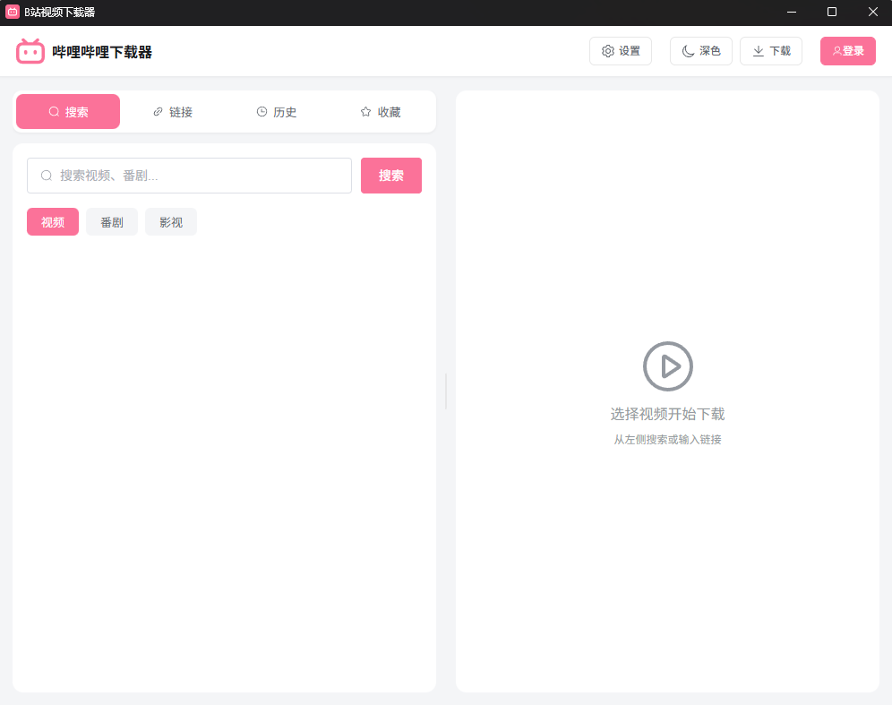
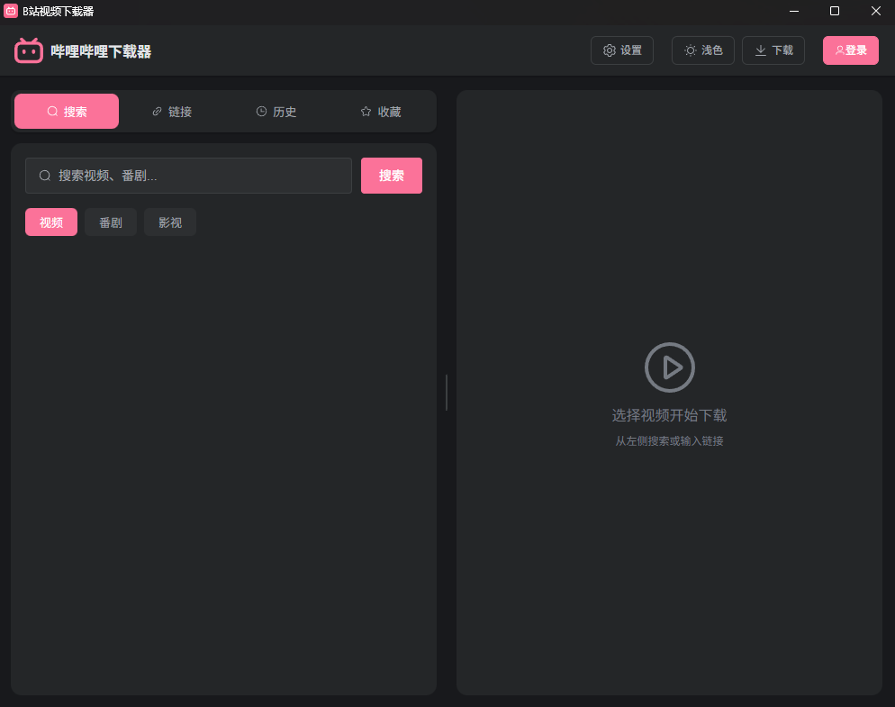

<p align="center">
  
</p>

<h1 align="center">B站视频下载器</h1>

<p align="center">
  <strong>🎬 简洁好用的哔哩哔哩视频下载工具</strong>
</p>

<p align="center">
  <a href="../../releases/latest"></a>
  <a href="../../releases"></a>
  <a href="./LICENSE"></a>
  <a href="../../stargazers"></a>
</p>

<p align="center">
  <a href="#-功能特性">功能特性</a> •
  <a href="#-截图预览">截图预览</a> •
  <a href="#-下载安装">下载安装</a> •
  <a href="#-使用说明">使用说明</a> •
  <a href="#-常见问题">常见问题</a>
</p>

---

## 📖 简介

**B站视频下载器** 是一款专为 Windows 用户打造的哔哩哔哩视频下载工具。采用现代化技术栈（Tauri + Vue 3）开发，界面简洁美观，操作简单易用，支持多种视频类型下载。

### 🎯 为什么选择它？

- **开箱即用** - 内置 yt-dlp、ffmpeg、aria2，下载即可使用，无需配置环境
- **下载快速** - 多线程加速下载，充分利用带宽
- **界面美观** - 现代化 UI 设计，支持深色模式
- **功能齐全** - 支持单视频、分P、番剧、合集、收藏夹、历史记录
- **持续更新** - 应用内一键检查更新

---

## ✨ 功能特性

| 功能 | 说明 |
|------|------|
| 🎬 **视频下载** | 支持单视频、分P视频、番剧、合集 |
| 📁 **批量下载** | 从收藏夹、历史记录批量下载 |
| 🔍 **视频搜索** | 内置搜索功能，快速找到想要的视频 |
| 🎨 **清晰度选择** | 支持 4K / 1080P / 720P / 480P / 360P |
| ⚡ **多线程加速** | 使用 aria2 多线程下载，速度更快 |
| 🔄 **断点续传** | 下载中断后可继续下载，不用重头开始 |
| 📋 **任务管理** | 支持暂停、继续、删除、重试等操作 |
| 🌙 **深色模式** | 保护眼睛，夜间使用更舒适 |
| ⬆️ **自动更新** | 应用内检查更新，一键下载安装 |
| 🔐 **扫码登录** | 登录后可下载更高清晰度 |

---

## 📸 截图预览

<p align="center">
  
</p>

<p align="center">
  
</p>

---

## 📦 下载安装

### 系统要求

- **操作系统**: Windows 10/11 (64位)
- **运行环境**: 无需额外安装

### 下载地址

前往 [**Releases 页面**](../../releases/latest) 下载最新版本：

| 版本 | 文件 | 说明 |
|------|------|------|
| 🚀 **便携版** | `bilibili-downloader_x64_portable.zip` | 解压即用，无需安装 |
| 📦 **安装版** | `bilibili-downloader_x64-setup.exe` | 双击安装，自动创建快捷方式 |

> 💡 **推荐使用便携版**，解压到任意目录即可使用，方便备份和迁移。

---

## 📖 使用说明

### 1️⃣ 下载视频

1. 复制 B 站视频链接（支持多种格式）
2. 粘贴到输入框，点击「获取信息」
3. 选择清晰度，点击「下载」

**支持的链接格式：**
- 普通视频: `https://www.bilibili.com/video/BV1xxxxxx`
- 番剧: `https://www.bilibili.com/bangumi/play/ep123456`
- 短链接: `https://b23.tv/xxxxxx`
- 直接输入 BV 号: `BV1xxxxxx`

### 2️⃣ 登录账号

点击左下角「登录」按钮，使用 B 站 APP 扫码登录。

**登录后的好处：**
- 可下载 1080P 及以上清晰度
- 可访问收藏夹和历史记录
- 部分视频需要登录才能下载

### 3️⃣ 批量下载

- **收藏夹下载**: 点击「收藏夹」标签，选择要下载的视频
- **历史记录下载**: 点击「历史记录」标签，选择要下载的视频
- **合集下载**: 获取合集信息后，可选择全部或部分下载

---

## ❓ 常见问题

### Q: 为什么有些视频下载失败？

**A:** 可能的原因：
- 视频需要登录才能观看 → 请先登录账号
- 视频需要大会员 → 本工具不支持下载大会员专享内容
- 网络问题 → 请检查网络连接，稍后重试

### Q: 为什么未登录时只能下载 720P？

**A:** 这是 B 站的限制，未登录用户只能观看 720P 及以下清晰度。登录后即可下载更高清晰度。

### Q: 为什么有些番剧/影视没有剧集？

**A:** 部分番剧/影视需要登录后才能获取剧集列表，请先登录账号。

### Q: 下载的视频在哪里？

**A:** 默认保存在系统「视频」文件夹，可在设置中修改下载路径。

### Q: 如何更新到最新版本？

**A:** 点击界面右上角的设置图标，选择「检查更新」，如有新版本会提示下载。

---

## 🛠️ 技术栈

- **前端**: Vue 3 + TypeScript + Element Plus
- **后端**: Tauri 2 + Rust
- **下载**: yt-dlp + aria2 + ffmpeg

---

## 🔧 开发

<details>
<summary>点击展开开发说明</summary>

### 环境要求

- Node.js 18+
- Rust 1.70+
- pnpm 或 npm

### 安装依赖

```bash
npm install
```

### 开发模式

```bash
npm run tauri dev
```

### 构建

```bash
npm run tauri build
```

### 类型检查

```bash
npx vue-tsc --noEmit
```

</details>

---

## 🚀 发布流程

<details>
<summary>点击展开发布说明</summary>

### 1️⃣ 更新版本号

需要同步修改以下文件中的版本号：

| 文件 | 位置 |
|------|------|
| `src-tauri/tauri.conf.json` | `"version": "x.x.x"` |
| `src-tauri/Cargo.toml` | `version = "x.x.x"` |
| `src/stores/app.ts` | `currentVersion` 常量 |

### 2️⃣ 更新发布说明

编辑 `RELEASE_NOTES.md`，写入本次版本的更新内容。

### 3️⃣ 提交代码并创建 Tag

```bash
git add .
git commit -m "release: vx.x.x"
git tag vx.x.x
git push origin main --tags
```

### 4️⃣ 自动构建发布

推送 tag 后，GitHub Actions 会自动：

1. 下载最新的 yt-dlp.exe、ffmpeg.exe、aria2c.exe
2. 执行 `npm run tauri build` 构建
3. 生成两个安装包：
   - `bilibili-downloader_x.x.x_x64_portable.zip` (便携版)
   - `bilibili-downloader_x.x.x-setup.exe` (NSIS 安装包)
4. 创建 GitHub Release，附带 RELEASE_NOTES.md 内容

### 5️⃣ 发布完成

用户可以从 GitHub Releases 页面下载新版本，应用内也会检测到更新提示。

</details>

---

## 📄 开源协议

本项目基于 [MIT License](./LICENSE) 开源。

---

## ⭐ 支持项目

如果这个项目对你有帮助，欢迎：

- ⭐ 点个 Star 支持一下
- 🐛 提交 Issue 反馈问题
- 🔀 提交 PR 贡献代码

[](https://star-history.com/#gaopengbin/bilibili-downloader&Date)

---

## 🙏 致谢

- [yt-dlp](https://github.com/yt-dlp/yt-dlp) - 视频提取核心
- [aria2](https://github.com/aria2/aria2) - 多线程下载
- [ffmpeg](https://ffmpeg.org/) - 音视频处理
- [Tauri](https://tauri.app/) - 桌面应用框架
- [Element Plus](https://element-plus.org/) - UI 组件库

---

<p align="center">
  <sub>Made with ❤️ by <a href="https://github.com/gaopengbin">gaopengbin</a></sub>
</p>


